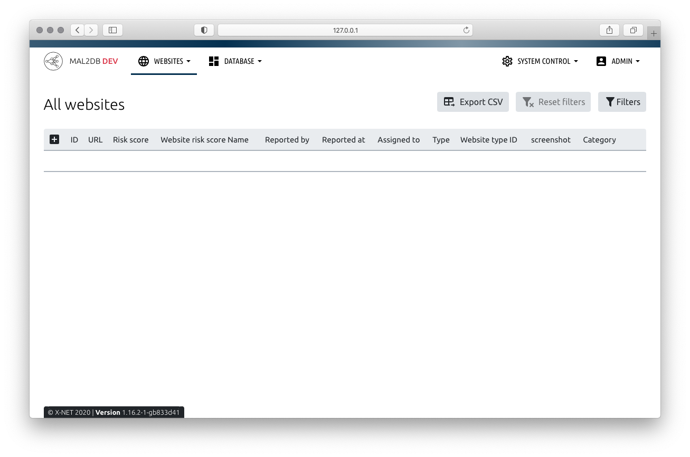

# Fake-Shop Detection Database

## About / Synopsis

* Management for manually classifying reported websites (e.g. via fake shop detection REST API).
* Project status: working/prototype
* Contact andrew.lindley@ait.ac.at

## Table of contents

> * [Requirements](#requirements)
> * [Installation](#installation)
> * [Usage](#usage)
>  * [Screenshots](#screenshots)
> * [REST-API](#rest-api)
> * [Resources (Documentation and other links)](#resources-documentation-and-other-links)
> * [License](#license)
> * [About MAL2](#about-mal2)

## Requirements

* Ubuntu 18.04
* Python 3.5
* PostgreSQL 10
* Python-Packages as defined in [requirments.txt](db/requirements.txt)

## Installation

Create a Python virtual environment with e.g. [virtualenvwrapper](https://virtualenvwrapper.readthedocs.io/en/latest/).
The Python version used is 3.5.

```shell
$ mkvirtualenv -p /path/to/python3.5 mal2DB
```

Install the required Python packages

```shell
pip install -r db/requirements.txt
```

PostgreSQL 10 is used as database. Create a database and change the `db/settings/base.py` accordingly.

```python
DB_HOST = "localhost"
DB_USER = "mal2db"
DB_NAME = "mal2db"
DB_PASSWORD = "MY_SECRET_PASSWORD"
```

After that, the database is initialized as follows:

```shell
cd db
./manage.py migrate
./manage.py loaddata init_groups
./manage.py loaddata init_website_risc_score
./manage.py loaddata init_website_types
./manage.py loaddata init_website_category
./manage.py loaddata init_websites_reported_by
```

The admin user is created with the following command:

```shell
$ ./manage.py createsuperuser
```

Enter a mail server in the `db/settings/base.py`.

```python
ADMINS = (
    ("Name", "name@domain.tld"),
)

SERVER_EMAIL = "name@domain.tld"

EMAIL_HOST = "mail.domain.tld"
EMAIL_HOST_USER = "mal2DB"
EMAIL_HOST_PASSWORD = "MY_SECRET_PASSWORD"

DEFAULT_FROM_EMAIL = "noreply@domain.tld"
```

### Chrome-Treiber für Selenium

To create web page screenshot the `chromium-chromedriver` is needed.

```
$ apt install chromium-chromedriver
```

## Usage

Now the server can be started with the Django command runserver.

```shell
./manage.py runserver
```

In your browser, you can now go to http://127.0.0.1:8000/.

Attention, this is for development only. In a production environment, for example, [uwsgi](https://uwsgi-docs.readthedocs.io/en/latest/WSGIquickstart.html) can be used with [apache2](http://httpd.apache.org/).
### Screenshots



## REST-API

The REST API documentation is available at http://127.0.0.1:8000/api.

## Resources (Documentation and other links)

* [Django Web Framework](https://docs.djangoproject.com/en/2.2/)
* [Django REST Framework](https://www.django-rest-framework.org/)


## About MAL2

The MAL2 project applies Deep Neural Networks and Unsupervised Machine Learning to advance cybercrime prevention by a) automating the discovery of fraudulent eCommerce and b) detecting Potentially Harmful Apps (PHAs) in Android.
The goal of the MAL2 project is to provide (i) an Open Source framework and expert tools with integrated functionality along the required pipeline – from malicious data archiving, feature selection and extraction, training of Machine Learning classification and detection models towards explainability in the analysis of results (ii) to execute its components at scale and (iii) to publish an annotated Ground-Truth dataset in both application domains. To raise awareness for cybercrime prevention in the general public, two demonstrators, a Fake-Shop Detection Browser Plugin as well as a Android Malware Detection Android app are released that allow live-inspection and AI based predictions on the trustworthiness of eCommerce sites and Android apps.

The work is based on results carried out in the research project [MAL2 project](https://projekte.ffg.at/projekt/3044975), which was partially funded by the Austrian Federal Ministry for Climate Action, Environment, Energy, Mobility, Innovation and Technology (BMK) through the ICT of the future research program (6th call) managed by the Austrian federal funding agency (FFG).
* Austrian Institute of Technology GmbH, Center for Digital Safety and Security [AIT](https://www.ait.ac.at/)
* Austrian Institute for Applied Telecommunications [ÖIAT](https://www.oiat.at)
* X-NET Services GmbH [XNET](https://x-net.at/de/)
* Kuratorium sicheres Österreich [KSÖ](https://kuratorium-sicheres-oesterreich.at/)
* IKARUS Security Software [IKARUS](https://www.ikarussecurity.com/)

More information is available at [www.malzwei.at](http://www.malzwei.at)

## Contact
For details on behalf of the MAL2 consortium contact: 
Andrew Lindley (project lead)
Research Engineer, Data Science & Artificial Intelligence
Center for Digital Safety and Security, AIT Austrian Institute of Technology GmbH
Giefinggasse 4 | 1210 Vienna | Austria
T +43 50550-4272 | M +43 664 8157848 | F +43 50550-4150
andrew.lindley@ait.ac.at | www.ait.ac.at
or
Woflgang Eibner, X-NET Services GmbH, we@x-net.at

## License
The MAL2 Software stack is dual-licensed under commercial and open source licenses. 
The Software in this repository is subject of the terms and conditions defined in file 'LICENSE.md'
